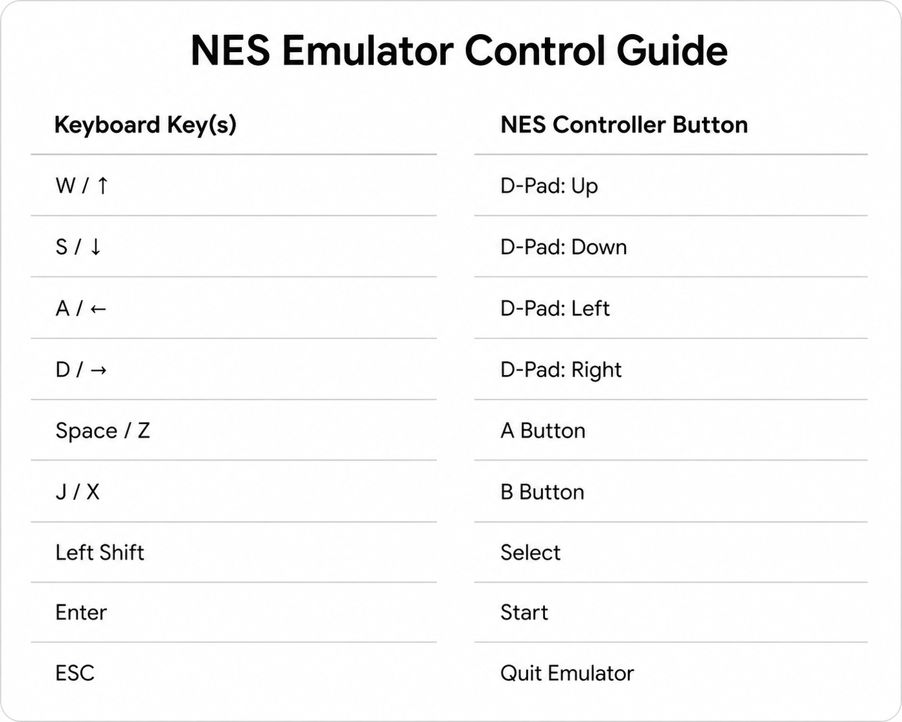

NES Emulator in Java

A complete NES emulator written in Java with all 256 CPU opcodes implemented.

* Features :

- Complete 6502 CPU: All 256 opcodes with proper addressing modes
- Memory Management: Full memory map with RAM, ROM, and I/O handling
- PPU (Picture Processing Unit): Basic graphics rendering support
- Cartridge Loading: iNES format support with mapper detection
- Display System: Java Swing-based display for visual output

* Architecture

* Core Components :

1. NesEmulator.java: Main emulator class that coordinates all components
2. CPU.java: 6502 processor with complete opcode implementation
3. Memory.java: Memory management system with proper address mapping
4. PPU.java: Picture Processing Unit for graphics rendering
5. Cartridge.java: iNES ROM file loader and mapper support
6. NesDisplay.java: Swing-based display interface

* CPU Instructions Implemented :

All 256 opcodes are implemented including:

- Arithmetic Operations: ADC, SBC
- Logical Operations: AND, ORA, EOR, BIT
- Shift Operations: ASL, LSR, ROL, ROR
- Load/Store: LDA, LDX, LDY, STA, STX, STY
- Transfer: TAX, TAY, TXA, TYA, TSX, TXS
- Stack Operations: PHA, PHP, PLA, PLP
- Branch Instructions: BCC, BCS, BEQ, BNE, BMI, BPL, BVC, BVS
- Jump/Call: JMP, JSR, RTS, RTI
- Flag Operations: CLC, CLD, CLI, CLV, SEC, SED, SEI
- Increment/Decrement: INC, INX, INY, DEC, DEX, DEY
- Compare: CMP, CPX, CPY
- No Operation: NOP

* How to Run the Emulator :

In Terminal:
# Compile all Java files
javac *.java

# Run with a ROM file (.nes file format)
java WorkingEmulator file.nes

* ROM Formats Supported :

The emulator supports standard iNES format (.nes files) with:

- PRG ROM (16KB or 32KB banks)
- CHR ROM (8KB pattern data)
- PRG RAM (8KB battery-backed RAM)
- Basic mirroring (horizontal/vertical)
- Mapper 0,2,3,4 and 7 (NROM) support
NOTE : Mapper 7 implementation is still under progress and is not working properly and other mappers will be added later.

* PPU Features :

- Basic background rendering
- Pattern table support
- Name table handling
- Palette management
- VBlank detection
- Scanline-based rendering

* Features to be added :

- Advanced mappers (MMC9, MMC90 (unofficial mapper), etc.)
- APU (Audio Processing Unit) cuz the games have no audio support for now.
- Save states
- Minor bug fixes

* Controls :

This project is built for fun only. Feel free to use and modify as needed !!!
